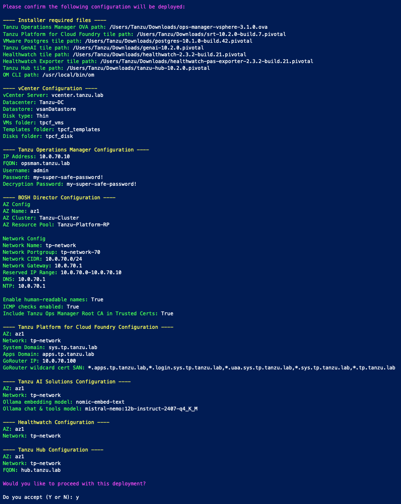
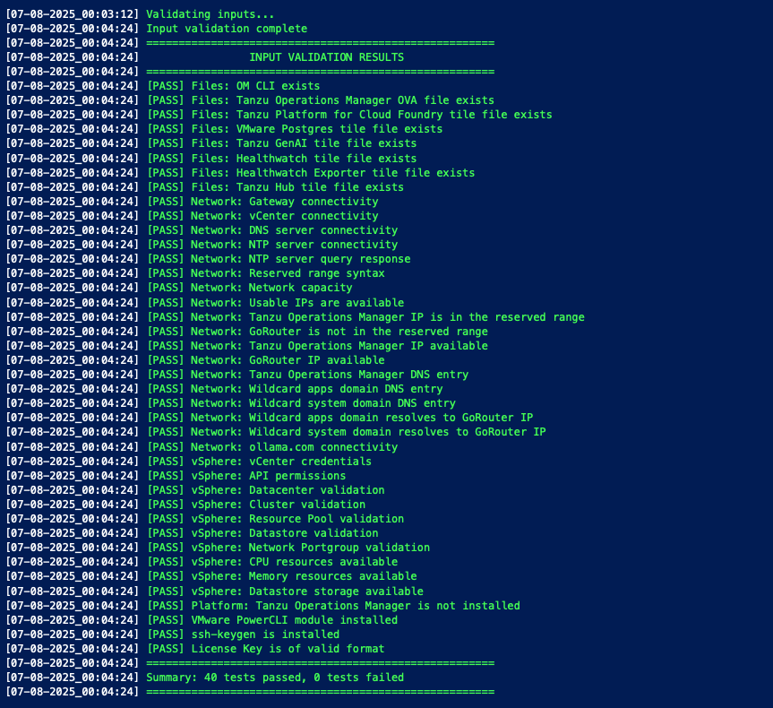
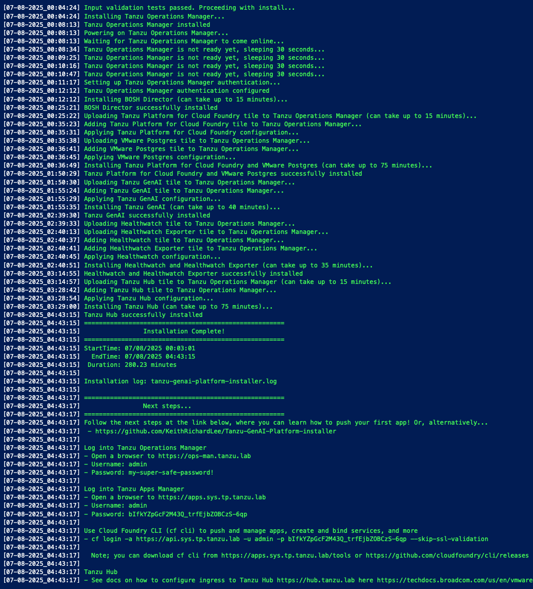

# Tanzu GenAI Platform installer

TL;DR - A powershell script that automates the install of VMware Tanzu Platform, a private PaaS which includes GenAI capabilites, on VMware vSphere with minimal resource requirements.

The installer takes minimum set of parameters, validates them, and then performs the install of the platform which includes VMware Tanzu Operations Manager, BOSH Director, Cloud Foundry runtime, VMware Postgres, Healthwatch, and GenAI service with models that have embedding, chat, and tools capabilities. Note, the script uses what is known as the Small Footprint Tanzu Platform for Cloud Foundry which is a repackaging of Tanzu Platform for Cloud Foundry into a smaller deployment with fewer VMs which is perfect for POC and sandbox work. Note, there are some limitations with small footprint which can be found [here](https://techdocs.broadcom.com/us/en/vmware-tanzu/platform/tanzu-platform-for-cloud-foundry/10-0/tpcf/toc-tas-install-index.html#limits). For a much more comprehensive automated install of Tanzu Platform, which uses [Concourse](https://concourse-ci.org/), check out the [Platform Automation Toolkit for Tanzu](https://techdocs.broadcom.com/us/en/vmware-tanzu/platform/platform-automation-toolkit-for-tanzu/5-2/vmware-automation-toolkit/docs-index.html)

## Prerequisites
**VMware vSphere**
  - ESXi host/cluster (ESXi v7.x or v8.x) with the following spare capacity...
    - Compute: ~72 vCPU, although only uses approx 6 GHz
    - Memory: ~120 GB
    - Storage: ~450 GB
  - User / service account with the [following privileges](https://techdocs.broadcom.com/us/en/vmware-tanzu/platform/tanzu-operations-manager/3-0/tanzu-ops-manager/vsphere-vsphere-service-account.html)

**Networking**
  - IP addresses
    - A subnet with at least 24 free IP addresses including two static IP addresses
      - 1x Tanzu Operations Manger
      - 1x GoRouter 
    
  - DNS
    - 3 records created
      - 1x VMware Tanzu Operations Manager eg opsman.tanzu.lab
      - 1x Tanzu Platform system wildcard eg *.sys.tp.tanzu.lab which will resolve to the GoRouter IP
      - 1x Tanzu Platfrom apps wildcard eg *.apps.tp.tanzu.lab which will resolve to the GoRouter IP
   
  - NTP service

  - Firewall
    - Ability to reach ollama.com so Tanzu Platform can download AI models (Note: Airgapped is supported but not covered in this guide & script at present. Please see [here](https://techdocs.broadcom.com/us/en/vmware-tanzu/platform-services/genai-on-tanzu-platform-for-cloud-foundry/10-0/ai-cf/tutorials-offline-model-support.html) for offline model support)

**Workstation/jump-host**
- [Powershell 7](https://learn.microsoft.com/en-us/powershell/scripting/install/installing-powershell) or later installed
- [VMware PowerCLI](https://techdocs.broadcom.com/us/en/vmware-cis/vcf/power-cli/latest/powercli/installing-vmware-vsphere-powercli/install-powercli.html) installed eg `Install-Module VMware.PowerCLI`
- [OM CLI](https://github.com/pivotal-cf/om) installed
- Following files downloaded...
  - [VMware Tanzu Operations Manager](https://support.broadcom.com/group/ecx/productdownloads?subfamily=VMware%20Tanzu%20Operations%20Manager)
  - [Small Footprint Tanzu Platform for Cloud Foundry](https://support.broadcom.com/group/ecx/productdownloads?subfamily=Tanzu%20Platform%20for%20Cloud%20Foundry)
  - [VMware Postgres](https://support.broadcom.com/group/ecx/productdownloads?subfamily=VMware+Tanzu+for+Postgres+on+Cloud+Foundry)
  - [GenAI for Tanzu Platform](https://support.broadcom.com/group/ecx/productdownloads?subfamily=GenAI%20on%20Tanzu%20Platform%20for%20Cloud%20Foundry)
  - [Healthwatch](https://support.broadcom.com/group/ecx/productdownloads?subfamily=Healthwatch)
  - [Healthwatch Exporter](https://support.broadcom.com/group/ecx/productdownloads?subfamily=Healthwatch)
- This repo cloned eg `git clone https://github.com/KeithRichardLee/Tanzu-GenAI-Platform-installer.git`


## Fill out required fields in the script
Update each instance of "FILL-ME-IN" in the script. See below for a worked example...

Update the path to the VMware Tanzu Operations Manager (OpsMan) OVA, Tanzu Platform for Cloud Foundry (TPCF) tile, VMware Postgres tile, VMware Tanzu GenAI tile, and OM CLI
```bash
### Full Path to Tanzu Operations Manager OVA, TPCF tile, Postgres tile, GenAI tile, and OM CLI
$OpsManOVA    = "/Users/Tanzu/Downloads/ops-manager-vsphere-3.0.40+LTS-T.ova"
$TPCFTile     = "/Users/Tanzu/Downloads/srt-10.0.5-build.2.pivotal"
$PostgresTile = "/Users/Tanzu/Downloads/postgres-10.0.0-build.31.pivotal"
$GenAITile    = "/Users/Tanzu/Downloads/genai-10.0.3.pivotal"
$OMCLI        = "/usr/local/bin/om"
```

Update infra config fields
```bash
### Infra config
$VIServer          = "vcenter.tanzu.lab"
$VIUsername        = "administrator@tanzu.lab"
$VIPassword        = 'my-super-safe-password!'
$VMDatacenter      = "Tanzu-DC"
$VMCluster         = "Tanzu-Cluster"
$VMResourcePool    = "Tanzu-Platform-RP"
$VMDatastore       = "vsanDatastore"
$VirtualSwitchType = "VSS"       
$VMNetwork         = "tp-network-70" 
$VMNetworkCIDR     = "10.0.70.0/24"  
$VMNetmask         = "255.255.255.0"
$VMGateway         = "10.0.70.1"
$VMDNS             = "10.0.70.1"
$VMNTP             = "10.0.70.1"
```

Update Tanzu Platform config fields
```bash
### Tanzu Platform config
$OpsManagerAdminPassword  = 'my-super-safe-password!'
$OpsManagerIPAddress      = "10.0.70.10"       
$OpsManagerFQDN           = "opsman.tanzu.lab"            
$BOSHNetworkReservedRange = "10.0.70.0-10.0.70.2,10.0.70.10,10.0.70.30-10.0.70.254"  #add IPs, either individual and/or ranges you _don't_ want BOSH to use in the subnet eg Ops Man, gateway, DNS, NTP, jumpbox
$TPCFGoRouter             = "10.0.70.20"                                             #IP which the Tanzu Platform system and apps domain resolves to. Choose an IP towards the end of available IPs
$TPCFDomain               = "tp.tanzu.lab"                                           #Tanzu Platform system and apps subdomains will be added to this. Resolves to the GoRouter IP
```

Update Healthwatch fields 
- Note; installing Healthwatch (observability) is optional. vSphere resource requirements drop to ~51 vCPU, ~105 GB memory, ~325 GB storage if Healthwatch is not installed.
```bash
### Install Healthwatch (observability)?
$InstallHealthwatch = $true
$HealthwatchTile         = "/Users/Tanzu/Downloads/healthwatch-2.3.2-build.21.pivotal"                #Download from https://support.broadcom.com/group/ecx/productdownloads?subfamily=Healthwatch
$HealthwatchExporterTile = "/Users/Tanzu/Downloads/healthwatch-pas-exporter-2.3.2-build.21.pivotal"   #Download from https://support.broadcom.com/group/ecx/productdownloads?subfamily=Healthwatch
```

## Run the script
- Open a powershell console eg `pwsh`
- Execute the script eg `tanzu-genai-platform-installer.ps1`
- Installation can take up to 3 hours. Install time depends on the performance of your underlying infrastructure. 

- Note; if this is your first time using Powershell with the VMware PowerCLI module, you may be prompted to participate in the VMware CEIP. You can accept/deny so not prompted again by running `Set-PowerCLIConfiguration -Scope User -ParticipateInCEIP $true or $false`

## Example of script output




# Next steps: Deploy a sample app
Below we will deploy a Spring chatbot application which can consume AI services by the platform

## Prerequisites
- Retrieve UAA admin credentials
  - The script on completion will print out the admin credentials for Tanzu Apps Manager and CF CLI, alternatively, you can retrieve them via Tanzu Operations Manager > Small Footprint Tanzu Platform for Cloud Foundry > Credentials > UAA > Admin Credentials

- Download CF CLI
  -  The above script on completion will print out how to download cf cli and how to run `cf login`, alternatively, see the [install docs](https://techdocs.broadcom.com/us/en/vmware-tanzu/platform/tanzu-platform-for-cloud-foundry/10-0/tpcf/install-go-cli.html) and [login docs](https://techdocs.broadcom.com/us/en/vmware-tanzu/platform/tanzu-platform-for-cloud-foundry/10-0/tpcf/getting-started.html)

- Create an Org and a Space
    - Create an Org
    ```bash
    cf create-org tanzu-demos-org
    ```
    - Create a Space
    ```bash
    cf create-space tanzu-demos-space -o tanzu-demos-org
    ```
    - Target an Org and Space
    ```bash
    cf target -o tanzu-demos-org -s tanzu-demos-space
    ```

- Download JDKs & SDKs
  - Note; [sdkman](https://sdkman.io) is a great tool for installing and managing many versions of various JDKs and SDKs
  - Java 21 or later
    - Install Java 21 if not already installed
    ```bash
    sdk install java 21.0.7-oracle
    ```
    - If already installed, make Java 21 the current candiate version, or which ever candidate version you have installed
    ```bash
    sdk use java 21.0.7-oracle
    ```
  - Maven 3.8 or later
    - Install Maven if not already installed
    ```bash
    sdk install maven
    ```
    - If you have Maven already installed, make Maven 3.8 or later the current candiate version, or which ever candidate version you have installed
    ```bash
    sdk use maven 3.9.9
    ```
- clone git repos
  ```bash
  git clone https://github.com/cpage-pivotal/cf-mcp-client
  git clone https://github.com/kirtiapte/bitcoin-mcp-server
  ```

## Deploy chat app

### Build the app
```bash
cd cf-mcp-client
mvn clean package
```

### Push the app to the platform
```bash
cf push
```

### Access the app
1. Retrieve the URL to the app
```bash
cf apps
```

2. Open the app in a browser and ask it a question!


### Bind to a LLM model
1. View services available
```bash
cf marketplace
```

2. View genai services available
```bash
cf marketplace -e genai
```

3. Create a service instance that provides chat LLM capabilities
```bash
cf create-service genai mistral-nemo chat-llm
```

4. Bind the service to the app
```bash
cf bind-service ai-tool-chat chat-llm
```

5. Restart the app to apply the binding
```bash
cf restart ai-tool-chat
```

Now the chatbot will use the LLM to respond to chat requests

Ask it for the price of bitcoin


### Bind to services so can do RAG
1. View genai services available
```bash
cf marketplace -e genai
```

2. Create a service instance that provides embedding LLM capabilities
```bash
cf create-service genai nomic-embed-text embedding-llm
```

3. Create a Postgres service instance to use as a vector database

```bash
cf create-service postgres on-demand-postgres-db vector-db
```

4. Bind the services to the app

```bash
cf bind-service ai-tool-chat embedding-llm 
cf bind-service ai-tool-chat vector-db
```

5. Restart the app to apply the binding

```bash
cf restart ai-tool-chat
```

6. Click on the document tool on the right-side of the screen, and upload a .PDF File

Now your chatbot will respond to queries about the uploaded document

### Deploy a MCP server
Model Context Protocol (MCP) servers are lightweight programs that expose specific capabilities to AI models through a standardized interface. These servers act as bridges between LLMs and external tools, data sources, or services, allowing your AI application to perform actions like searching databases, accessing files, or calling external APIs without complex custom integrations.

1. Build the app
```bash
cd ../bitcoin-mcp-server
mvn clean package
```

2. Push the app to the platform
```bash
cf push
```

3. Retrieve the URL to the bitcoin app
```bash
cf apps
```

4. Create a user-provided service that provides the URL for the bitcoin MCP server
```bash
cf cups bitcoin-mcp-server -p '{"mcpServiceURL":"http://bitcoin-mcp-server.apps.tp.tanzu.lab"}'
```

5. Bind the MCP service to your chatbot app
```bash
cf bind-service ai-tool-chat bitcoin-mcp-server
```

6. Restart your chatbot app
```bash
cf restart ai-tool-chat
```

Your chatbot will now register with the MCP server, and the LLM will be able to invoke the agent's capabilities when responding to chat requests

Ask it for the current price of bitcoin


# Appendix

## Resources
- [VMware Tanzu AI Solutions website](https://www.vmware.com/solutions/app-platform/ai)
- [Tanzu Platform Marketplace Services](https://github.com/KeithRichardLee/VMware-Tanzu-Guides/blob/main/Tanzu-Platform/Tanzu-Platform-Marketplace-Services.md)
- [How to install MinIO object storage server to host Ollama and vLLM models offline](https://github.com/KeithRichardLee/VMware-Tanzu-Guides/blob/main/Tanzu-AI-Solutions/how-to-install-minio-to-host-ollama-and-vllm-models-offline.md)

## Troubleshooting
- An install log can be found where you run the script from with a file name of tanzu-genai-platform-installer.log. It contains verbose logging.

## Validation
Script validated against the following versions...
- Tanzu Operations Manager: ops-manager-vsphere-3.0.40+LTS-T.ova
- Tanzu Platform for Cloud Foundry small footprint: srt-10.0.5-build.2.pivotal
- VMware Postgres: postgres-10.0.0-build.31.pivotal
- Tanzu GenAI: genai-10.0.3.pivotal
- Healthwatch: healthwatch-2.3.2-build.21.pivotal
- Healthwatch Exporter: healthwatch-pas-exporter-2.3.2-build.21.pivotal
- OM CLI: 7.15.1
- Powershell: 7.5.1
- PowerCLI: 13.3.0
- vCenter: 8U3
